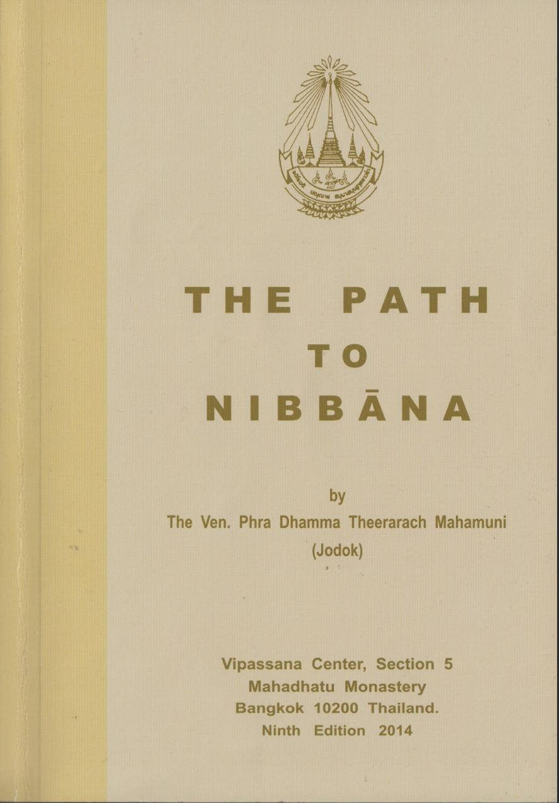

# The Path to Nibbāna
## Phra Dhamma Theerarach Mahamuni (Ajahn Jodok)

## Get it!

The book is produced in several formats:

* [HTML](https://edhamma.github.io/jodok-path/html/index.html)
* [single HTML](https://edhamma.github.io/jodok-path/singlehtml/index.html)
* [ePub](https://edhamma.github.io/jodok-path/epub/jodok-path-to-nibbana.epub) (for e-book readers)
* [PDF](https://edhamma.github.io/jodok-path/latex/JodokPath.pdf) (A5 pagesize)

(other formats supported by [Sphinx](https://sphinx-doc.org) can be added trivially)

## How to help

The source of the e-book is hosted at https://github.com/edhammajodok-path. You are welcome to create pull requests to fix any mistakes (be it small typos or anything more substantial). Once the pull request is accepted by me, the e-book(s) at github.io will be updated automatically within minutes.

