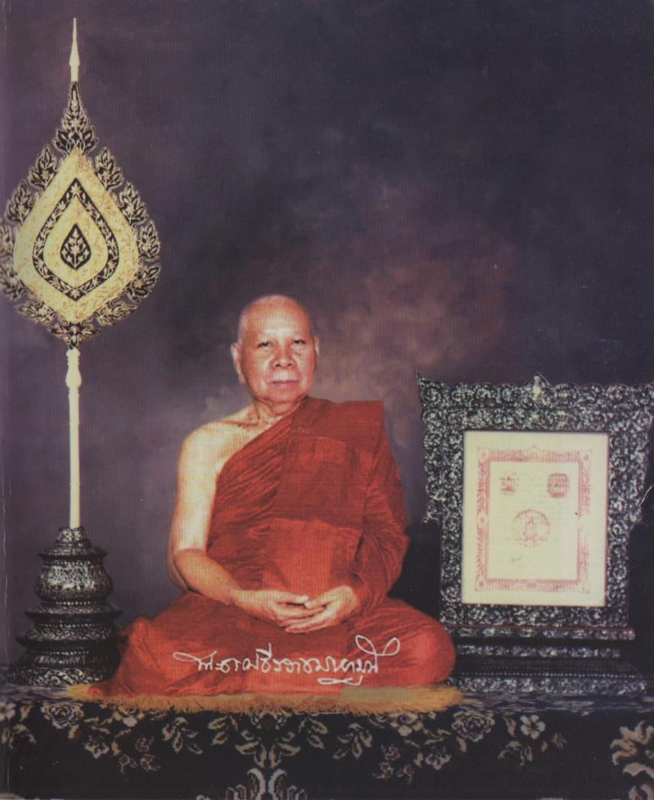

Front
-------

.. hack: abuse code as indication for Thai in LaTeX

.. raw:: latex

   \let\sphinxcode\textthai
   \newfontfamily\thaifont[Script=Thai]{Norasi}

   The Ven. Phra Dhamma Theerarach Mahamuni

   ``พระธรรมธีรราชมหามุนี (โชดก ญาณสิทฺธิเถร ส.ธ.๙)``

   ``พระอาจารย์าใหญ่ฝ่ายวิปัสสนาธุระ``

.. raw:: latex
   
   \setcounter{section}{0}

.. todo:: Wat Mahathat logo

| THE PATH TO NIBBĀNA
| (An Introduction to Insight Meditation)
| by The Ven.Phra Dhamma Theerarach Mahamuni (Jodok)
| Graduate of the Highest State Pali Examination of Thailand.
| Chief Master for Vipassana Meditation in Thailand.
|
| Vipassana Center Section 5, Mahādhātu Monastery
| Bangkok 10200 Thailand.
| Tel. 2226011
|
| NINTH EDITION 2014

.. admonition:: Electronic edition notice 

   In a few places, obvious erros of the print were corrected. Footnotes with Pali locations were added. Spelling of Pali words was left intact.

.. raw:: latex 

   \clearpage

Foreword to the English Translation
~~~~~~~~~~~~~~~~~~~~~~~~~~~~~~~~~~~~

The path to Nirvana, which you are holding in your hands, is translated from "The Path to Nirvava- Thai version -. It is a directt ranaslation of the original book of the Ven. Phra Dhamma Threerarach Maharnuni (Jodok Yannasit). The content of this book is emphasized to the Insight Vipassana method handbook,including the evaluation of meditation as The Discourse of Four Foundations of Mindfulness and the result of insight meditation. The path to Nirvana is suitable for all people who would like to understand, get inside and develop their mind. The wisdom and peace from meditation will encourage family, society, nation, religion and then make the peaceful world.

This book has been published in 8 editions, during various occasions. This edition is the 9th, the English publishing for each edition is on behalf of the burden of contemplation division, Vipassana Center, where the Center of Buddhist propagation. This international Vipassana Center has been supported by The Ven. Phra Dhamma Threerarach Mahamuni (Jodok Yannasit), who is the former abbot of Mahadhatu Monsatery, and the Ven. Somdet buddahchan (Art Asapathera).

| Phrakhruvimolthammarangsee
| Vice-abbot of Mahadhatu Temple
| Section 5

.. raw:: latex 

   \clearpage

Translator's Introduction
~~~~~~~~~~~~~~~~~~~~~~~~~~~

This book is the work of the late Ven. Phra Dhamma Theerarach Mahamuni Mahāthera, the late head of the meditation masters in Thailand, who passed away on the 30th of June 1988.

While he was alive he taught meditation to both Thais and foreigners in Thailand and throughout the world. The Vipassana Centre at Wat Mahadhatu considers that "the Path to Nibbana" is one of the most useful of his books for meditators and those who are interested in meditation. This book covers both theory and practical exercises. So the Vipassana Centre at Section 5, Wat Mahadhatu has decided to reprint this book, to be used as a guide to help those who are interested in Vipassana meditation.

There are three parts to this book. Part 1 is theory. Part 2 is exercises for meditation practice and part 3 is a manual for checking you Vipassana progress.

We hope that this book will prove useful for those who are interested in practising meditation. It can be used as a guide for beginners, but the book alone is not enough, it should be used as additional guidance when practising with a meditation teacher. Those who have extensive experience should consult a meditation master.

We sincerely hope you make progress in your meditation practice.

| May all beings be well and happy.
| **Vorasak Jandamit**
| **Helen Jandamit**
| on behalf of the Vipassana Centre at Wat Mahadhatu, Bangkok.
| 1st November, 1989

.. raw:: latex 

   \clearpage

Foreword to the 3rd Edition
~~~~~~~~~~~~~~~~~~~~~~~~~~~~~~

| *Dhammo have rakkhati dhaṃmacāriṃ chattaṃ mahanthaṃ viya vassakāle.*

| The Dhamma shelters the Dhamma-followers like a Great umbrella in the rainy season.

The Principal Teaching of Lord Buddha comprises three categories: The Study of the Scriptures (Pariyatti Dhamma), the Practice of the Dhamma (Patipatti-Dhamma), and Realization (Pativedha-Dhamma). They depend upon each other. Then they can develop Buddhism in the future.

**The Study of the Scriptures** refers to the study of the Tipitaka, the Three Collections of the Buddha's Teaching in which are contained morality (Sila), concentration (Samadhti) and Wisdom (Paññā).

**The Practice of the Dhamma** is directed towards training in and development of ethical conduct, concentration of mind and intuitive wisdom through the system of Budhist Meditation.

**The Stage of Realization being** the result of the practice, brings about Enlightenment and Complete Freedom from all forms of mental defilements. This is termed, "Realization" according to the Buddhist sense and aim of life.

The Study of the Scriptures is like a whole coconut.

The Practice of the Dhamma is like breaking a coconut.

The stage of Realizations is like breaking a coconut and eating all its contents.

All followers should cultivate these three stages so that they will have peace and happiness in present and future lives.

May they all attain the happiness of Nibbana.

| **The Ven. Phra Dhamma Theerarach Mahamuni**
| Vipassana Meditation Centre,
| Section 5, Mahadhatu Monastery
| 9 October 1971

.. raw:: latex

   \egroup
   \mainmatter
   % promote sections for the main text
   % (unlike in frontmatter and appendix)
   \iffalse
      \let\subsubsection\subsection
      \let\subsection\section
      \let\section\chapter
      \let\chapter\part
   \fi

